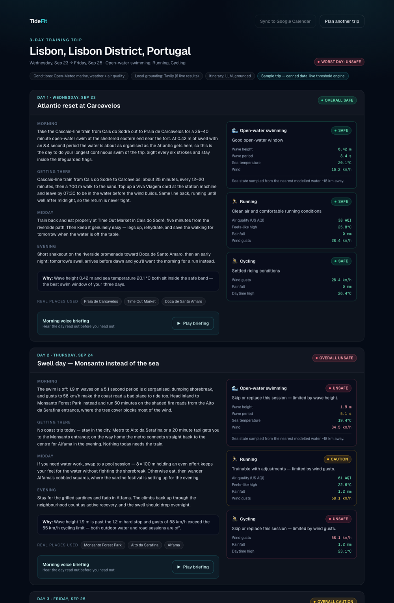

# TideFit

**Trip planning for athletes who need to train while they travel.**

Most travel planners tell you the weather. TideFit tells you whether you can actually train. Give it
a destination, some dates and your sports, and it fetches sport-specific condition data for every
day of the trip, classifies each day **safe / caution / unsafe** against tunable thresholds, then
writes a day-by-day plan around real local places — narrated as a short morning voice briefing.

A swimmer gets marine sea state. A runner gets air quality. Cyclists and hikers get wind, heat and
UV. Every verdict carries the measurement that produced it, so a badge is always explainable. On an
unsafe day the plan changes: the session moves indoors, or the sport swaps, rather than cheerfully
sending you into 1.9 m shorebreak.

Originally built for the Checkout Travel & Hospitality Hackathon.

---

## Try it

**See it live: <https://tide-fit.vercel.app>** — plan a trip, or open the
[sample Lisbon trip](https://tide-fit.vercel.app/trip/demo-lisbon). The live site runs with no paid
API keys, so itineraries are rule-based rather than LLM-written; everything else is the real thing.

To run your own copy, none of these need API keys, accounts or configuration. With nothing set you still get
live condition data from Open-Meteo, real safety classification, a rule-based itinerary and a
device-voice briefing.

**In your browser, nothing to install:**

[](https://codespaces.new/UtkarshMitta/tide-fit?quickstart=1)

GitHub builds the project in a cloud machine, starts it, and opens the app in a new tab. The first
start takes a couple of minutes while dependencies install. Codespaces is free within GitHub's
monthly allowance for personal accounts.

**Your own live copy on the web:**

[](https://vercel.com/new/clone?repository-url=https%3A%2F%2Fgithub.com%2FUtkarshMitta%2Ftide-fit&stores=%5B%7B%22type%22%3A%22blob%22%2C%22access%22%3A%22private%22%7D%5D)

Vercel copies the repo to your GitHub account, creates a private Blob store to keep planned trips
in, and deploys it to a public URL. Accept the storage step when it's offered and leave every
environment variable blank. Shared trip links then work from any device. Add Supabase later (see
[Deploying](#deploying)) if you also want sign-in and a per-user list of saved trips.

**On your own machine:**

```bash
git clone https://github.com/UtkarshMitta/tide-fit.git
cd tide-fit
nvm use                      # or install Node 22+ any other way
npm install
cp .env.example .env.local   # every key is optional
npm run dev
```

Then open <http://localhost:3000>.

### What you'll see

Enter a destination, pick dates and sports, and you get a day-by-day plan with a **safe / caution /
unsafe** verdict for each sport and the measurement behind each verdict. With the optional keys set,
the plan also names real local spots and lists bookable stays nearby. To see a finished example without planning anything, open **`/trip/demo-lisbon`**. It's a
3-day Lisbon trip where day 2 refuses an open-water swim in 1.9 m surf and moves the session
inland.



Adding keys turns on more, feature by feature — see [Configuration](#configuration). Nothing breaks
when a key is missing; that feature just degrades.

---

## How it works

The pipeline lives in [`src/lib/planner.ts`](src/lib/planner.ts): geocode → fetch and classify
conditions per sport → ground the plan in live web search → write the itinerary → find lodging near
the session. Every stage degrades on its own, so a dead upstream costs you that feature rather than
the trip.

**Per-sport condition engine.** Swimmers get wave height, wave period and sea surface temperature.
Runners get air quality as US AQI. Cyclists and hikers get wind gusts, feels-like temperature,
rainfall and UV. Severe weather codes (thunderstorms, heavy freezing rain) override everything.

**Missing data is never treated as good news.** A metric with no forecast is `unknown`, and a day
containing any `unknown` cannot come back `safe`. Air-quality forecasts run about 5 days out and
weather about 16; days beyond those horizons are marked "no data" rather than given a false verdict.
A swim is never graded on wind alone when the sea state is missing.

**Grounded itineraries.** Tavily search results are fed into the itinerary prompt, and the model may
only name venues that appear in those results. The plan names the place, never the page: forums and
social sites are excluded from the search, URLs are withheld from the prompt, and publisher
suffixes are stripped from headlines. Search results are treated as untrusted data — they are
sanitised and fenced so a web page cannot issue instructions to the model.

**Marine data for inland cities.** Marine models only cover water cells, so a city centroid a few
kilometres inland returns nulls. TideFit probes outward in eight directions (throttled, since
Open-Meteo rejects bursts), uses the nearest cell with a sea state, and tells you how far away it
sampled. With no modelled water within 60 km it says so and plans pool sessions instead of guessing.

**Bookable lodging near the session, not the city centroid.** Stay22's Accommodations API supplies
real stays with live prices and ratings, measured from the training spot — a named beach or
trailhead when search and geocoding can pin one, otherwise an honest fallback to the city centre.

**Travel logistics in every day plan.** Mode of transport, door-to-door time, when to leave and how
to get back, grounded in a live local-transport search once the training spot is known.

**Briefed out loud.** Each day is narrated by ElevenLabs, cached by content hash so replays don't
re-bill. `/api/voice` takes a trip id and a date and builds the script server-side, so it cannot be
used as an open text-to-speech proxy. Without an ElevenLabs key the browser's own speech synthesis
reads the briefing instead.

### Tuning the safety rules

Every safety number lives in [`src/lib/thresholds.ts`](src/lib/thresholds.ts):

```ts
swimming: [
  { kind: "ceiling", key: "waveHeightMax", label: "Wave height", unit: "m",
    safeUpTo: 0.5, cautionUpTo: 1.2 },
  ...
]
```

Three rule shapes cover every metric: `ceiling` (bigger is worse), `floor` (smaller is worse, like a
short choppy wave period) and `window` (a comfort band with bad extremes, like temperature).
`maxRisk` caps how bad a single metric may make a day, so rain and UV degrade a session without
declaring it unsafe on their own.

Check your changes against live data without touching the UI:

```bash
npm run check:conditions -- "Lisbon" "Denver"
```

### How lodging ranking works

Two tiers, so the trip page always has somewhere to stay:

1. **Stay22 Accommodations API** (`STAY22_API_KEY`) — live inventory centred on the training spot,
   with prices for your dates, ratings, thumbnails and a deeplink per supplier. TideFit picks the
   cheapest supplier that actually quoted, prices in local currency, and reads the affiliate id back
   out of the returned links so the map widget matches the booking links.
2. **Tavily fallback** (`TAVILY_API_KEY`) — a search scoped to booking sites and filtered to URL
   shapes that are a single property page rather than a "10 best hotels" listicle. Real names and
   working links, no prices.

Ranking deserves a note, because the naive version is bad. The feed is ordered by distance, so at a
city centroid the first rows are one-review studios — while the best-reviewed hotels often have no
price for the requested dates. The tiers therefore require *both* review credibility and a live
quote, relaxing only to fill remaining slots. Requesting a larger page makes this worse rather than
better: `pageSize=20` pads the response with duplicates and unpriced rows, while ~12 comes back
unique and fully priced. Quality decides which five stays make the list; the list is then sorted
cheapest first, since that is the order a traveller compares in.

Check any destination without touching the UI:

```bash
npm run check:lodging
```

---

## Configuration

Everything below is optional. Copy `.env.example` to `.env.local` and fill in what you want.
Condition data from Open-Meteo (geocoding, marine, forecast, air quality) needs no key at all.

| Variable | What it turns on | Without it |
|---|---|---|
| `TAVILY_API_KEY` | Live web search grounding, so the plan names real spots and events | Generic session descriptions, no named venues |
| `OPENAI_API_KEY` | LLM-written itinerary (`OPENAI_MODEL`, default `gpt-4o-mini`) | Deterministic rule-based template |
| `ELEVENLABS_API_KEY` | Studio voice narration (`ELEVENLABS_VOICE_ID`, `ELEVENLABS_MODEL_ID`) | Your browser's built-in speech synthesis |
| `STAY22_API_KEY` | Bookable stays with live prices | Tavily search across booking sites — names and links, no prices |
| `NEXT_PUBLIC_STAY22_AID` | Affiliate id for the map widget | Read back from the API response when `STAY22_API_KEY` is set |
| `OPENWEATHER_API_KEY` | Air quality via OpenWeatherMap instead of Open-Meteo | Open-Meteo `us_aqi` |
| `NEXT_PUBLIC_SUPABASE_URL` + `NEXT_PUBLIC_SUPABASE_ANON_KEY` | Sign-in and per-user saved trips | No sign-in; trips stored on Blob if available, otherwise in memory |
| `BLOB_STORE_ID` or `BLOB_READ_WRITE_TOKEN` | Durable trip storage on Vercel Blob; set automatically by the Deploy button | Trips kept in server memory and a temp-dir cache |
| `SUPABASE_SERVICE_ROLE_KEY` | Owner-only row-level security — **see [Deploying](#deploying)** | Trip storage uses the anon key and the original schema |
| `TIDEFIT_SECRET_KEY` | Encrypts visitor-pasted Strava secrets before they touch a cookie | The paste-your-own-credentials path is refused |
| `GOOGLE_CLIENT_ID` + `GOOGLE_CLIENT_SECRET` | Google Calendar sync | Sync button disabled |
| `STRAVA_CLIENT_ID` + `STRAVA_CLIENT_SECRET` | Training-load-aware intensity for every visitor | Each visitor can supply their own app credentials instead |
| `NEXT_PUBLIC_APP_URL` | Base URL used to build OAuth redirect URIs | Falls back to `VERCEL_URL` when deployed on Vercel, else `http://localhost:3000` |
| `TIDEFIT_DEMO_MODE` | Forces the canned Lisbon trip for every request | Normal planning |

### Optional setup

- **Supabase** — run `supabase/schema.sql` in the SQL editor, then set the two `NEXT_PUBLIC_SUPABASE_*`
  values. For anything public, also read [Deploying](#deploying) before you expose it.
- **Google Calendar** — create an OAuth client with redirect URI `{APP_URL}/api/calendar/callback`
  and the `calendar.events` scope.
- **Strava** — two ways to enable it:
  - **Host-configured (recommended):** set `STRAVA_CLIENT_ID` / `STRAVA_CLIENT_SECRET` and every
    visitor connects through one shared app. Nothing sensitive reaches the browser.
  - **Visitor-supplied:** leave those blank and set `TIDEFIT_SECRET_KEY` instead. Each visitor
    pastes their own Client ID and Secret from
    [strava.com/settings/api](https://www.strava.com/settings/api) (Authorization Callback Domain =
    your host; TideFit uses `{APP_URL}/api/strava/callback`). The secret is encrypted with
    AES-256-GCM before it goes into a 7-day cookie, so the cookie holds ciphertext that is useless
    without your server key. Without `TIDEFIT_SECRET_KEY` this path is refused rather than storing
    a third-party secret in plaintext.

  Without Strava, trips still plan; intensity just isn't auto-adjusted from recent training.

---

## Development

```bash
npm run dev          # dev server on :3000
npm test             # unit tests (node:test via tsx)
npm run typecheck    # tsc --noEmit
npm run lint         # eslint (flat config)
npm run build        # production build; works with zero keys
npm run check:rls    # probes your Supabase project the way an attacker would
```

CI runs typecheck, lint, test and a zero-key build on every push and pull request
([`.github/workflows/ci.yml`](.github/workflows/ci.yml)).

Tests in [`src/lib/safety.test.ts`](src/lib/safety.test.ts) concentrate on the parts where being
wrong matters: the classifier's fail-safe behaviour, threshold boundaries, the OAuth return path,
the untrusted-text sanitiser and the Strava training-load summary.

> **Don't run `npm run build` while `npm run dev` is live.** They share `.next/`, and the build
> clobbers the dev server's vendor chunks — you get a spurious
> `Cannot find module './vendor-chunks/...'` 500. Stop the dev server first.

### Project layout

```
src/lib/planner.ts      the end-to-end pipeline
src/lib/conditions.ts   geocoding, per-sport condition fetch, classification
src/lib/thresholds.ts   every safety number, in one tunable file
src/lib/search.ts       Tavily wrapper + untrusted-text sanitiser
src/lib/itinerary.ts    LLM itinerary + deterministic fallback
src/lib/voice.ts        ElevenLabs TTS with per-character caching
src/lib/stay22.ts       Stay22 Accommodations API client + quality ranking
src/lib/lodging.ts      lodging discovery: Stay22 first, Tavily fallback
src/lib/anchor.ts       resolves where the training actually happens
src/lib/calendar.ts     Google Calendar OAuth + event creation
src/lib/strava.ts       Strava OAuth + training load summary
src/lib/oauth-state.ts  CSRF nonce shared by both OAuth flows
src/lib/rate-limit.ts   per-IP limits on the endpoints that cost money
src/lib/store.ts        trip persistence: Supabase, then Vercel Blob, then memory
src/lib/blob-store.ts   private Vercel Blob storage for trips
src/lib/demo.ts         the canned Lisbon trip
src/components/         DayCard, LodgingList, LodgingMap, AudioBriefing, StravaConnect
supabase/               schema plus the hardened RLS migration
```

### Demo safety

Live demos break when sponsor APIs rate-limit on stage, so there are three layers of protection:

1. **A canned sample trip** at `/trip/demo-lisbon` — a 3-day Lisbon multi-sport trip with
   pre-written itinerary text and search results. Its measurements still run through the real
   `classifyDay` pipeline, so the demo can never disagree with the live threshold config. Day 2
   deliberately shows the planner refusing an open-water swim in 1.9 m surf.
2. **Pre-rendered narration.** Run `npm run demo:audio` before going on stage to bake the three
   ElevenLabs clips into `public/audio/`. The player uses them if present and only calls the API
   when they are missing.
3. **A panic switch.** Set `TIDEFIT_DEMO_MODE=true` and every trip request returns the sample trip,
   regardless of destination.

---

## Deploying

Push to GitHub, import into Vercel, and add the same environment variables. Set
`NEXT_PUBLIC_APP_URL` to your deployed origin so the OAuth redirect URIs match.

Serverless instances don't share memory, so a deployment needs durable storage for shared trip
links to work. The Deploy button handles this by attaching a private Vercel Blob store. On a manual
import, add one under **Storage → Create → Blob** and connect it to the project. From the CLI:

```bash
npx vercel link --yes
npx vercel blob create-store tidefit-trips --access private --yes
npx vercel deploy --prod
```

`.vercelignore` keeps every local `.env*` file out of CLI uploads, so a Supabase service-role key in
your `.env.local` can't end up in a deployment by accident. Note that `vercel link` writes a
short-lived `VERCEL_OIDC_TOKEN` into `.env.local`, and may add a broad `.env*` rule to `.gitignore`
that would also hide `.env.example`; the existing `.env*.local` rule already covers the secrets. With neither Blob
nor Supabase, a shared link can 404 when a different instance serves it. Supabase takes priority
over Blob when both are configured, and adds sign-in and per-user trip lists.

**Before you expose a deployment publicly, do these two things in this order:**

1. Set `SUPABASE_SERVICE_ROLE_KEY` in the server environment — never with a `NEXT_PUBLIC_` prefix.
2. Run [`supabase/002_tighten_rls.sql`](supabase/002_tighten_rls.sql) in the Supabase SQL editor.

Verify it worked with `npm run check:rls`, which probes the table using only the public anon key.

The original `supabase/schema.sql` grants `select using (true)` on the trips table. Because the
anon key ships to the browser by design, that makes **every saved trip readable by anyone** who
takes that key from your page source — destinations, dates and full itineraries for every user. The
migration makes trips owner-only; the service-role key is what lets the server keep serving shared
links. Doing step 2 without step 1 leaves the app unable to read any trip.

Rate limits on `/api/trips` and `/api/voice` are in-process, so the effective ceiling is
`limit x instances`. That is fine for one host or a small deployment. For real production traffic,
move them behind a shared store (Vercel KV, Upstash) or your platform's WAF.

### Running it in public

A public deployment's built-in limiter counts per server instance, stored trips never expire, and
every visitor shares the deployment's Open-Meteo quota. One firewall rule covers most of that,
because each planned trip is one API call:

1. In the Vercel dashboard, open the project → **Firewall** → **Configure** → **+ New Rule**.
2. Condition: **Request Path** *starts with* `/api/`.
3. Action: **Rate Limit**, fixed window of **60s**, **20** requests, keyed by **IP**, response
   **429**.
4. **Save Rule** → **Review Changes** → **Publish**.

The Hobby plan allows one rate-limit rule per project, which is why the condition covers every API
route at once. Vercel counts it at the edge before your code runs, so unlike the in-process limiter
it holds across instances. Counters are tracked per region.

Stored trips (about 10 KB each) accumulate in Blob until deleted. With the firewall rule in place
that growth is slow. If it ever matters, `npx vercel blob list-stores` shows the store id and
`npx vercel blob empty-store <store-id>` clears it. That deletes every saved trip, so existing shared
links stop working.

Vercel's Hobby plan and Open-Meteo's free API are both licensed for non-commercial use only.

---

## Security

The repository has been audited; findings, severities and what was fixed are in
[`docs/AUDIT.md`](docs/AUDIT.md). Two things are worth knowing before you deploy:

- **Trips are protected by an unguessable URL, not by an access check.** Anyone holding a trip link
  can read that trip. That is intended — it is what makes a shared itinerary work — but it means a
  trip id is a secret.
- **Visitor-pasted Strava secrets are encrypted before they reach a cookie.** They are sealed with
  AES-256-GCM under `TIDEFIT_SECRET_KEY` and stored for 7 days (`httpOnly`, `SameSite=lax`, and
  `Secure` whenever `NEXT_PUBLIC_APP_URL` is `https`), so the cookie carries ciphertext rather than
  a usable credential. Without that key the paste path is refused outright. Host-configured
  `STRAVA_CLIENT_ID` / `STRAVA_CLIENT_SECRET` remains the simplest option for a public deployment,
  since then no visitor secret exists at all.

Before exposing a deployment, run `npm run check:rls`. It takes your public anon key and asks
PostgREST for the trips table, exactly as an attacker would, and tells you whether the hardened RLS
policies are actually in force. A network failure is reported as inconclusive rather than as a
pass — it never hands back a false all-clear.

`npm audit` currently reports **zero vulnerabilities**. The app runs on Next 16 and React 19; the
Next 14 advisory set that the audit originally flagged is gone with the upgrade.

---

## Stack

Next.js 16 (App Router) · React 19 · TypeScript · Tailwind CSS · Supabase (auth + saved trips) · Vercel

**APIs:** Open-Meteo Geocoding, Marine, Forecast and Air Quality (no key) · Tavily (search
grounding) · OpenAI (itinerary) · ElevenLabs (narration) · Stay22 (Accommodations API + map widget)
· OpenWeatherMap (optional air quality) · Google Calendar (optional sync) · Strava (optional
training load)

---

## Disclaimer

Condition classifications come from forecast models and a threshold config. They are a planning aid,
not a guarantee — always defer to local lifeguards, trail authorities, and how you feel on the day.

## License

[0BSD](LICENSE) — public-domain-equivalent. Use it for anything, commercially or otherwise, with no
attribution required and no conditions attached.
